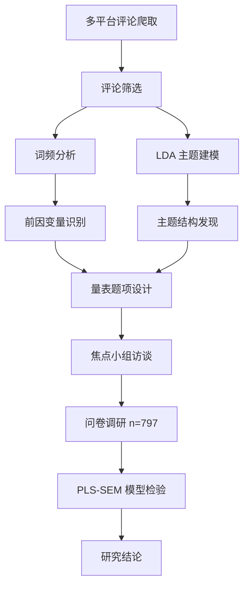

# AI 社交代理舆情分析与采纳意愿研究

> 多平台舆情挖掘 × 量化结构方程建模（PLS-SEM），从"用户怎么说"到"用户为什么用"的完整闭环。

[](https://github.com/AicbLab/social-agent-elys)


---

## 📖 项目简介

本项目围绕 **AI 社交代理（Social Agent / 数字分身）** 的公众认知与采纳意愿，开展两阶段实证研究：

1. **质性 + 文本挖掘阶段**：爬取 B 站、微博、知乎、小红书、豆瓣等平台共 **26,658 条**评论，通过关键词过滤、词频分析与 LDA 主题建模，提炼用户关注的 **前因变量与主题结构**。
2. **量化建模阶段**：基于前述前因变量设计 5 点 Likert 量表，开展焦点小组访谈与问卷调研，最终获得 **n = 797** 的有效样本，使用 **PLS-SEM** 检验"推力—赋能—价值—阻力—采纳—行为意愿"完整路径。

### 核心成果速览

- ✅ **14 个潜变量构念全部通过信效度检验**（α 0.80–0.94，CR 0.86–0.95）
- ✅ **HTMT 区分效度成立**（理论独立构念对均 < 0.85）
- 🎯 **采纳强度 R² = 0.547**；付费意愿 / 使用意愿 / 托付程度 R² > 0.73
- 🔑 关键路径：`自我延伸可信度 (β=0.429)` + `认知负荷卸载 (β=0.415)` → **采纳强度** → 三类行为意愿（β > 0.85）

---

## 📁 项目结构

```text
social-agent-elys/
├── 文本分析代码/                     # 文本挖掘与 LDA 主题分析脚本
│   ├── text_mining.py                # 词频分析（前因变量识别）
│   ├── filter_relevant_comments.py   # AI 社交代理相关评论筛选
│   ├── strict_filter_ai_agent.py     # 严格关键词筛选
│   ├── lda_filtered.py               # 基础筛选 LDA（推荐入口）
│   ├── lda_ai_agent_final.py         # 最终版 LDA
│   ├── lda_elys_strict.py            # 严格筛选版 LDA
│   ├── lda_loose_then_filter.py      # 宽松抽取 + 后过滤
│   ├── lda_pure_relevant.py          # 纯净评论 LDA
│   ├── lda_extract_relevant.py       # 主题抽取
│   ├── lda_bertopic_analysis.py      # LDA + BERTopic 联合分析
│   ├── parse_lda.py                  # 主题结果解析
│   ├── parse_lda_filtered.py         # 筛选后主题解析
│   ├── run_lda.py / run_lda_simple.py  # 通用 LDA 入口
│   └── generate_report.py            # 自动化报告生成
│
├── text-mining-data/                 # 文本挖掘原始数据与中间产物
│   ├── B站.csv / 微博.csv / 知乎.csv / 小红书.csv / 豆瓣.csv
│   ├── 所有评论.txt                  # 全平台合并（26,658 条）
│   ├── AI社交代理相关评论.txt        # 初筛结果
│   ├── AI社交代理严格筛选评论.txt    # 严格筛选结果
│   ├── AI社交代理最终筛选评论.txt    # 最终筛选结果
│   ├── LDA*.csv / AI社交代理_LDA*.csv  # 各版本 LDA 输出
│   ├── 前因变量分析结果.csv          # 前因变量识别汇总
│   ├── 前因变量分析图表.png          # 前因变量可视化
│   └── 筛选后的典型评论.csv          # 典型评论样本
│
├── survey_797.csv                    # 最终建模样本（n = 797）
├── figure1.png                       # PLS-SEM 路径图（概念模型）
├── 图2.png                           # PLS-SEM 路径图（估计结果）
├── README.md
└── .gitignore
```

> **说明**：`*.docx`、`*.xlsx`、`*.md`（README 除外）等文档已通过 `.gitignore` 排除，
> 仅以 Python 脚本 / CSV / PNG / TXT 等开放格式同步至仓库。

---

## 🔬 研究设计

### 整体流程



### 阶段一 · 文本挖掘

| 步骤 | 输出 |
|---|---|
| 1. 多平台爬取（B 站 / 微博 / 知乎 / 小红书 / 豆瓣） | `text-mining-data/*.csv` |
| 2. 关键词 + 语义筛选 | `AI社交代理相关评论.txt`（22,249 条） |
| 3. jieba 分词 + 词频统计 | 识别 **16 个前因变量** |
| 4. LDA 主题建模 | 发现 **10 大主题**（Top 3：AI 社交互动 16.11%、AI 训练与人类 14.69%、AI 数字人应用 12.59%） |

### 阶段二 · 量化建模

- **量表设计**：14 个潜变量 × 每变量 5 题项，5 点 Likert
- **样本结构**：学生 + 见数预调研 + 真实样本，最终 **n = 797**
- **建模工具**：SmartPLS（PLS-SEM，重复指标法处理二阶反映构念）

#### 模型核心构念

| 类型 | 构念 |
|---|---|
| 推力（Push） | 社交焦虑 SA、社交倦怠 SB → **(2) 社交痛苦驱动** |
| 阻力（Concern） | 隐私顾虑 PC、控制需求 NFC、AI 替代威胁 ART、数字伦理意识 DEA → **(2) 风险与控制顾虑** |
| 赋能（Enabler） | 技术自我效能感 TSE |
| 价值（Value） | AI 人情味感知 HTP、数字自我延伸 DSC → **(中) 自我延伸可信度** |
| 中介 | (中) 认知负荷卸载（SCO）、(中) 身份一致顾虑（SIR） |
| 因变量 | 采纳强度 → 使用意愿 UI、托付程度 DE、付费意愿 WTP |

#### 关键路径系数（Bootstrap, n = 797）

| 路径 | β | T | p |
|---|---:|---:|---:|
| 自我延伸可信度 → 采纳强度 | **0.429** | 14.80 | <0.001 |
| 认知负荷卸载 → 采纳强度 | **0.415** | 13.56 | <0.001 |
| 身份一致顾虑 → 采纳强度 | **−0.064** | 2.50 | 0.013 |
| 技术自我效能感 → 认知负荷卸载 | **0.560** | 16.93 | <0.001 |
| AI 人情味感知 → 自我延伸可信度 | **0.369** | 9.19 | <0.001 |
| 风险与控制顾虑 → 身份一致顾虑 | **0.646** | 28.40 | <0.001 |
| 采纳强度 → 付费意愿 / 使用意愿 / 托付程度 | **0.85 ~ 0.87** | >67 | <0.001 |

---

## 🛠️ 环境与运行

### 依赖安装

```bash
pip install jieba gensim pandas numpy matplotlib scikit-learn
```

### 文本挖掘流水线

```bash
# 1) 词频分析
python 文本分析代码/text_mining.py

# 2) 评论筛选
python 文本分析代码/filter_relevant_comments.py
python 文本分析代码/strict_filter_ai_agent.py

# 3) LDA 主题建模（推荐）
python 文本分析代码/lda_filtered.py

# 4) 结果解析与报告
python 文本分析代码/parse_lda_filtered.py
python 文本分析代码/generate_report.py
```

### 量化建模（SmartPLS）

- 加载 `survey_797.csv`，配置 14 个潜变量与路径；
- 内部估计采用路径加权方案（path weighting），二阶反映构念采用重复指标法；
- Bootstrap：5000 次重抽样，BCa 置信区间；
- 盲折（Blindfolding）omission distance d = 7。

---

## 📊 主要结果

### 信度与效度（n = 797）

- **Cronbach α**：0.804 ~ 0.938（全部 ≥ 0.70）
- **CR**：0.865 ~ 0.945（全部 ≥ 0.70）
- **AVE**：一阶构念全部 ≥ 0.572；二阶 / 合成构念 0.46 ~ 0.49（CR 高，可接受）
- **HTMT**：理论独立构念对均 < 0.85；超阈值仅出现于"二阶 ↔ 一阶子构念"的结构必然高相关
- **VIF**：1.13 ~ 2.78，无共线性问题

### 解释力与预测力

| 内生变量 | R² | Q² (Blindfolding) |
|---|---:|---:|
| 自我延伸可信度 | 0.390 | 0.219 |
| 认知负荷卸载 | 0.370 | 0.235 |
| 身份一致顾虑 | 0.418 | 0.246 |
| **采纳强度** | **0.547** | 0.266 |
| 付费意愿 | 0.730 | 0.503 |
| 使用意愿 | 0.733 | 0.470 |
| 托付程度 | 0.757 | 0.491 |

### 主要发现

1. **价值 + 卸载 是采纳的双引擎**：自我延伸可信度与认知负荷卸载贡献了采纳强度的绝大部分变异；
2. **顾虑虽显著但效应弱**：身份一致顾虑对采纳强度仅 β = −0.064，AI 替代/隐私/控制/伦理顾虑的总效应均 ≤ 0.013（绝对值）；
3. **技术自我效能感是最强远端前因**：通过双中介路径间接效应达 0.380；
4. **采纳→意愿/托付/付费 高度同质**：β 区间 0.854 ~ 0.870，意味"采纳强度"作为整合性意向具有跨场景稳健性；
5. **人口学差异不显著**：年龄、性别、教育对采纳强度均不显著（p > 0.05）。

---

## 📚 引用

```bibtex
@misc{social-agent-elys-2026,
  title         = {AI 社交代理舆情分析与采纳意愿研究 (social-agent-elys)},
  author        = {AicbLab},
  year          = {2026},
  publisher     = {GitHub},
  howpublished  = {\url{https://github.com/AicbLab/social-agent-elys}}
}
```

---

## 📝 版本历史

- **2026-05-15**（当前）：移除所有中间分析 `.md` 文档（保留 README）；新增 `figure1.png` / `图2.png` 路径图；`.gitignore` 更新为排除 `*.md`（README 除外）
- **2026-05-15**：完成 PLS-SEM 主模型估计（n = 797）；新增 `.gitignore` 排除 doc 类文档
- **2026-04-21**：迁移至 `social-agent-elys`，重构项目结构与文档
- **2026-04-20**：完成多版本 LDA 分析与严格筛选；词频分析与前因变量识别

---

## 📄 许可证

本项目仅用于学术研究目的。

## 🤝 贡献

欢迎通过 Issue / Pull Request 提交改进建议。

---

**开发者**：AicbLab  
**项目地址**：<https://github.com/AicbLab/social-agent-elys>  
**最后更新**：2026-05-15
