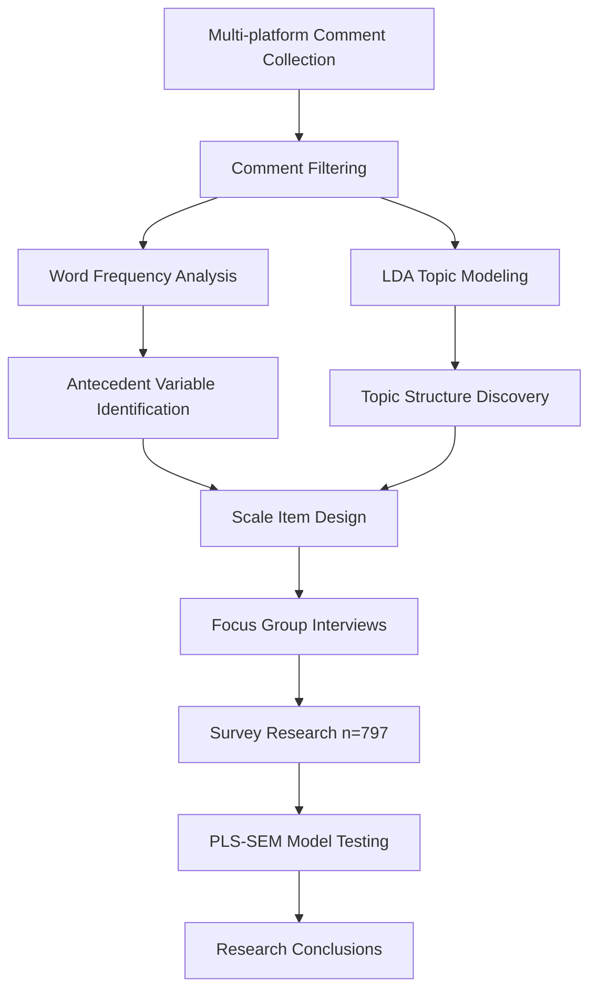

# AI Social Agent: Public Opinion Mining and Adoption Intention Study

> Multi-platform opinion mining × PLS-SEM structural equation modeling — a complete pipeline from "what users say" to "why users adopt."

[](https://github.com/AicbLab/social-agent-elys)


---

## Overview

This project investigates public perception and adoption intention of **AI Social Agents (digital avatars / social proxies)** through a two-stage empirical study:

1. **Qualitative + Text Mining Stage**: Collected **26,658 comments** from five Chinese social media platforms (Bilibili, Weibo, Zhihu, Xiaohongshu, Douban). Applied keyword filtering, word-frequency analysis, and LDA topic modeling to extract **antecedent variables and thematic structures** of user concerns.
2. **Quantitative Modeling Stage**: Designed 5-point Likert scales based on identified antecedents, conducted focus group interviews and survey research, obtaining a final sample of **n = 797**. Used **PLS-SEM** to test the full path: Push → Enabler → Value → Concern → Adoption → Behavioral Intention.

### Key Results at a Glance

- **14 latent constructs all passed reliability and validity checks** (Cronbach's α 0.80–0.94, CR 0.86–0.95)
- **HTMT discriminant validity confirmed** (all theoretically independent construct pairs < 0.85)
- **Adoption Intensity R² = 0.547**; Willingness to Pay / Usage Intention / Delegation Extent R² > 0.73
- Key paths: `Self-Extension Trust (β = 0.429)` + `Cognitive Offloading (β = 0.415)` → **Adoption Intensity** → three behavioral intentions (β > 0.85)

---

## Repository Structure

```text
social-agent-elys/
├── text-mining-data/                           # Raw data and intermediate outputs
│   ├── Bilibili.csv                            # Platform-specific comments
│   ├── Weibo.csv
│   ├── Zhihu.csv
│   ├── Xiaohongshu.csv
│   ├── Douban.csv
│   ├── all_comments.txt                        # Merged across platforms (26,658 entries)
│   ├── related_comments.txt                    # Initial keyword-filtered subset
│   ├── strictly_filtered_comments.txt          # Strictly filtered subset
│   ├── final_filtered_comments.txt             # Final filtered subset
│   ├── antecedent_analysis_results.csv         # Antecedent variable identification
│   ├── antecedent_analysis_chart.png           # Antecedent visualization
│   ├── typical_comments_after_filter.csv       # Representative comment samples
│   ├── LDA_topic_distribution.csv              # LDA topic distribution
│   ├── LDA_topic_analysis_results.csv          # LDA analysis output
│   ├── LDA_topic_parsing_results.csv           # Parsed topic labels
│   ├── LDA_loose_topic_distribution.csv        # Loose-filter topic distribution
│   ├── LDA_loose_pending_topics.csv            # Loose-filter candidate topics
│   ├── LDA_NPMI_results.csv                    # NPMI coherence scores
│   ├── AI_agent_LDA_*.csv                      # Multiple LDA model outputs (7 variants)
│   └── AI_agent_*_comments.txt                 # Filtered comment subsets (3 variants)
│
├── survey_797.csv                              # Final survey dataset (n = 797)
├── fig 1.png                                   # PLS-SEM path diagram (conceptual model)
├── fig 2.png                                   # PLS-SEM path diagram (estimated results)
├── SmartPLS screenshot(but partially in Chinese).png  # SmartPLS output screenshot
├── README.md
└── .gitignore
```

> **Note**: Documents in `*.docx`, `*.xlsx`, `*.pdf`, `*.pptx` and similar formats are excluded via `.gitignore`. Only open formats (CSV, TXT, PNG, PY) are tracked in this repository.

---

## Research Design

### Overall Pipeline



### Stage 1 — Text Mining

| Step | Output |
|---|---|
| 1. Multi-platform crawling (Bilibili / Weibo / Zhihu / Xiaohongshu / Douban) | `text-mining-data/*.csv` |
| 2. Keyword + semantic filtering | `related_comments.txt` (22,249 entries) |
| 3. jieba segmentation + word-frequency counting | Identified **16 antecedent variables** |
| 4. LDA topic modeling | Discovered **10 major topics** (Top 3: AI Social Interaction 16.11%, AI Training & Humans 14.69%, AI Digital Human Applications 12.59%) |

### Stage 2 — Quantitative Modeling

- **Scale Design**: 14 latent constructs × 5 items each, 5-point Likert scale
- **Sample**: Student pilot + pre-survey + final sample, **n = 797**
- **Tool**: SmartPLS (PLS-SEM, repeated-indicators approach for second-order reflective constructs)

#### Core Constructs

| Category | Construct |
|---|---|
| Push | Social Anxiety (SA), Social Burnout (SB) → **Social Pain Drive** |
| Concern | Privacy Concern (PC), Need for Control (NFC), AI Replacement Threat (ART), Digital Ethics Awareness (DEA) → **Risk & Control Concern** |
| Enabler | Technology Self-Efficacy (TSE) |
| Value | AI Human-like Perception (HTP), Digital Self-Concept (DSC) → **Self-Extension Trust** |
| Mediator | Cognitive Offloading (SCO), Self-Identity Relevance (SIR) |
| DV | Adoption Intensity → Usage Intention (UI), Delegation Extent (DE), Willingness to Pay (WTP) |

#### Key Path Coefficients (Bootstrap, n = 797)

| Path | β | T | p |
|---|---:|---:|---:|
| Self-Extension Trust → Adoption Intensity | **0.429** | 14.80 | <0.001 |
| Cognitive Offloading → Adoption Intensity | **0.415** | 13.56 | <0.001 |
| Self-Identity Relevance → Adoption Intensity | **−0.064** | 2.50 | 0.013 |
| Technology Self-Efficacy → Cognitive Offloading | **0.560** | 16.93 | <0.001 |
| AI Human-like Perception → Self-Extension Trust | **0.369** | 9.19 | <0.001 |
| Risk & Control Concern → Self-Identity Relevance | **0.646** | 28.40 | <0.001 |
| Adoption Intensity → WTP / UI / DE | **0.85–0.87** | >67 | <0.001 |

---

## Key Findings

### Reliability and Validity (n = 797)

- **Cronbach's α**: 0.804–0.938 (all ≥ 0.70)
- **Composite Reliability (CR)**: 0.865–0.945 (all ≥ 0.70)
- **AVE**: First-order constructs all ≥ 0.572; second-order / composite constructs 0.46–0.49 (acceptable given high CR)
- **HTMT**: All theoretically independent construct pairs < 0.85; threshold exceeded only for structurally expected high correlations between second-order and first-order sub-constructs
- **VIF**: 1.13–2.78, no multicollinearity issues

### Explanatory and Predictive Power

| Endogenous Variable | R² | Q² (Blindfolding) |
|---|---:|---:|
| Self-Extension Trust | 0.390 | 0.219 |
| Cognitive Offloading | 0.370 | 0.235 |
| Self-Identity Relevance | 0.418 | 0.246 |
| **Adoption Intensity** | **0.547** | 0.266 |
| Willingness to Pay | 0.730 | 0.503 |
| Usage Intention | 0.733 | 0.470 |
| Delegation Extent | 0.757 | 0.491 |

### Main Conclusions

1. **Value + Offloading are the dual engines of adoption**: Self-Extension Trust and Cognitive Offloading account for the majority of variance in Adoption Intensity.
2. **Concerns are significant but weak in effect**: Self-Identity Relevance has only β = −0.064 on Adoption Intensity; total effects of AI replacement / privacy / control / ethics concerns are all ≤ 0.013 in absolute value.
3. **Technology Self-Efficacy is the strongest distal antecedent**: Indirect effect through dual mediation paths reaches 0.380.
4. **Adoption → Intention / Delegation / Payment is highly homogeneous**: β range 0.854–0.870, indicating Adoption Intensity as an integrative intention is robust across scenarios.
5. **Demographic differences are non-significant**: Age, gender, and education show no significant effects on Adoption Intensity (p > 0.05).

---

## Environment and Reproduction

### Dependencies

```bash
pip install jieba gensim pandas numpy matplotlib scikit-learn
```

### Quantitative Modeling (SmartPLS)

- Load `survey_797.csv` and configure 14 latent variables with structural paths
- Inner estimation: path weighting scheme; second-order reflective constructs via repeated-indicators approach
- Bootstrap: 5,000 resamples with BCa confidence intervals
- Blindfolding: omission distance d = 7

---

## Citation

```bibtex
@misc{social-agent-elys-2026,
  title         = {AI Social Agent: Public Opinion Mining and Adoption Intention Study},
  author        = {AicbLab},
  year          = {2026},
  publisher     = {GitHub},
  howpublished  = {\url{https://github.com/AicbLab/social-agent-elys}}
}
```

---

## Changelog

- **2026-06-07**: Re-initialized repository with `github/` folder as root; removed legacy analysis scripts; added LDA NPMI coherence results
- **2026-05-15**: Completed PLS-SEM model estimation (n = 797); added path diagrams; updated `.gitignore`
- **2026-04-21**: Migrated to `social-agent-elys` repository; restructured project layout
- **2026-04-20**: Completed multi-variant LDA analysis and strict filtering; word-frequency and antecedent identification

---

## License

This project is intended for academic research purposes only.

## Contributing

Contributions via Issues or Pull Requests are welcome.

---

**Maintainer**: AicbLab  
**Repository**: <https://github.com/AicbLab/social-agent-elys>  
**Last Updated**: 2026-06-07
