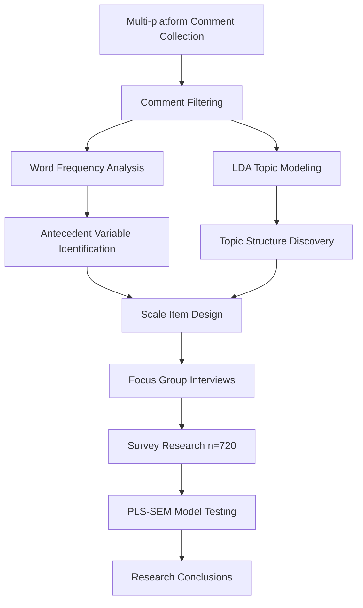

# AI Social Agent: Public Opinion Mining and Anticipated Adoption Study

> Multi-platform opinion mining × PLS-SEM structural equation modeling — a complete pipeline from "what users say" to "why users adopt."
>
> **Status**: Under revision (R1) for *Information Technology & People* (Emerald)

[](https://github.com/AicbLab/social-agent-elys)


---

## Overview

This project investigates public perception and anticipated adoption of **AI Social Agents (digital avatars / social proxies)** through a two-stage empirical study:

1. **Qualitative + Text Mining Stage**: Collected **28,888 raw comments** from five Chinese social media platforms (Bilibili, Weibo, Zhihu, Xiaohongshu, Douban). After cross-platform deduplication and relevance screening, 22,204 comments were preserved (retention rate 77.47%). Applied LDA topic modeling (k = 10, C_v = 0.5478) to extract **antecedent constructs and thematic structures** of user concerns.
2. **Quantitative Modeling Stage**: Designed 5-point Likert scales based on identified antecedents, conducted focus group interviews (4 groups, 29 participants) and survey research, obtaining a final sample of **n = 671**. Used **PLS-SEM** (SmartPLS 3) to test the full path: Push + Enabler + Value + Concern → Anticipated Adoption Intensity.

### Key Results at a Glance

- **13 constructs passed reliability and validity checks** (Cronbach's α 0.848–0.925, CR 0.890–0.939)
- **HTMT discriminant validity confirmed** (all theoretically independent construct pairs < 0.85)
- **Anticipated Adoption Intensity R² = 0.533** (model explains ~53% of variance)
- Key paths: `Digital Self-Extension Credibility (β = 0.564)` + `Perceived Cognitive Benefit (β = 0.211)` → **Anticipated Adoption Intensity**
- AAI modeled as **formative construct** via PCA single-indicator method (usage intention, delegation extent, willingness to pay)

---

## Repository Structure

```text
social-agent-elys/
├── text-mining-data/                           # Raw data and intermediate outputs
│   ├── Bilibili.csv                            # Platform-specific comments
│   ├── Weibo.csv
│   ├── Zhihu.csv
│   ├── Xiaohongshu.csv
│   ├── Douban.csv
│   ├── LDA_*.csv                               # LDA model outputs and topic distributions
│   ├── LDA_NPMI_results.csv                    # NPMI coherence scores
│   └── *.txt / *.csv                           # Filtered comments and analysis results
│
├── survey_671_clean.txt                        # Cleaned survey data (n = 671)
├── pls_algorithm_results.txt                   # Extracted PLS-SEM results (R², f², VIF, model fit)
├── pls_key_results.txt                         # Key results summary
├── bootstrap_indirect.txt                      # Bootstrap indirect effects (5,000 resamples)
├── outer_loadings_raw.txt                      # Outer loadings and weights
├── smartpls_all_results.txt                    # Full SmartPLS extraction
├── FIGURE.tif                                  # Research model diagram (Figure 1)
├── README.md
└── .gitignore
```

> **Note**: Documents in `*.docx`, `*.xlsx`, `*.pdf`, `*.pptx` and similar formats are excluded via `.gitignore`. Only open formats (CSV, TXT, PNG, PY) are tracked in this repository.

---

## Research Design

### Overall Pipeline


```mermaid
graph TB
    A[Multi-platform Comment Collection] --> B[Comment Filtering]
    B --> C[Word Frequency Analysis]
    B --> D[LDA Topic Modeling]
    C --> E[Antecedent Variable Identification]
    D --> F[Topic Structure Discovery]
    E --> G[Scale Item Design]
    F --> G
    G --> H[Focus Group Interviews]
    H --> I[Survey Research n=720]
    I --> J[PLS-SEM Model Testing]
    J --> K[Research Conclusions]
```

### Stage 1 — Text Mining

| Step | Output |
|---|---|
| 1. Multi-platform collection (Bilibili / Weibo / Zhihu / Xiaohongshu / Douban) | `text-mining-data/*.csv` (28,888 raw comments) |
| 2. Cross-platform deduplication + relevance screening | 22,204 valid comments retained (retention rate 77.47%) |
| 3. jieba segmentation + LDA topic modeling | **10 topics** identified (k = 10, C_v = 0.5478, NPMI = −0.247) |
| 4. Construct extraction | **11 antecedent constructs** from 3 relevant topics + 3 theory-derived outcome constructs |

### Stage 2 — Quantitative Modeling

- **Scale Design**: 14 latent constructs × 5 items each, 5-point Likert scale
- **Focus Groups**: 4 groups, 29 participants, 2×2 stratified design (high/low anxiety × high/low AI experience)
- **Sample**: Two channels (snowball + panel pool), **n = 671** (after removing straight-lining and suspicious responses from initial n = 720)
- **Tool**: SmartPLS 3 (PLS-SEM, repeated-indicators approach for second-order reflective constructs)
- **AAI Operationalization**: Formative construct via PCA single-indicator method (3 PCA scores as formative indicators)

#### Core Constructs

| Category | Construct |
|---|---|
| Push | Social Anxiety (SA), Social Burden (SB) → **Social Pain Drive (SPD)** |
| Concern | Privacy Concern (PC), Need for Control (NFC), AI Risk Tolerance (ART), Delegation Ethics Awareness (DEA) → **Risk & Control Concern (RCC)** |
| Enabler | Tech Self-Efficacy (TSE) |
| Value | Human Touch Perception (HTP), Digital Self-Extension Credibility (DSC) |
| Mediator | Perceived Cognitive Benefit (PCB), Social Identity Risk (SIR) |
| DV (formative) | **Anticipated Adoption Intensity (AAI)** ← Usage Intention (UI), Delegation Extent (DE), Willingness to Pay (WTP) via PCA |

#### Key Path Coefficients (Bootstrap 5,000, n = 671)

| Path | β | t | p |
|---|---:|---:|---:|
| Digital Self-Extension Credibility → AAI | **0.564** | 19.714 | <0.001 |
| Perceived Cognitive Benefit → AAI | **0.211** | 6.976 | <0.001 |
| Risk & Control Concern → AAI (direct) | **0.130** | 3.081 | 0.002 |
| Social Identity Risk → AAI | **−0.113** | 2.985 | 0.003 |
| Social Pain Drive → AAI | **0.105** | 3.121 | 0.002 |
| Tech Self-Efficacy → DSC | **0.500** | 15.687 | <0.001 |
| Tech Self-Efficacy → PCB | **0.320** | 9.186 | <0.001 |
| Human Touch Perception → DSC | **0.400** | 12.453 | <0.001 |
| Risk & Control Concern → SIR | **0.635** | 25.114 | <0.001 |

---

## Key Findings

### Reliability and Validity (n = 671)

- **Cronbach's α**: 0.848–0.925 (all ≥ 0.70)
- **Composite Reliability (CR)**: 0.890–0.939 (all ≥ 0.70)
- **AVE**: Most constructs ≥ 0.50; RCC and SPD slightly below 0.50 due to repeated indicators approach for second-order reflective constructs
- **HTMT**: All theoretically independent construct pairs < 0.85; threshold exceeded only for structurally expected high correlations between second-order and first-order sub-constructs
- **VIF**: 1.172–2.995, no multicollinearity issues
- **CMB**: Harman's single-factor test (23.81% < 50%) and Full Collinearity VIF (all < 3.3) confirm CMB is not a serious threat

### Explanatory and Predictive Power

| Endogenous Variable | R² | Q²_predict (PLSpredict) |
|---|---:|---:|
| Digital Self-Extension Credibility | 0.384 | 0.230 |
| Perceived Cognitive Benefit | 0.102 | 0.062 |
| Social Identity Risk | 0.402 | 0.247 |
| **Anticipated Adoption Intensity** | **0.533** | 0.378 |

### Main Conclusions

1. **DSC + PCB are the dual engines of anticipated adoption**: Digital Self-Extension Credibility (β = 0.564) dominates as the strongest proximal driver, followed by Perceived Cognitive Benefit (β = 0.211).
2. **Risk concerns show a dual effect**: RCC inhibits adoption indirectly through Social Identity Risk (indirect β = −0.071, p = 0.003) but directly facilitates adoption (direct β = 0.130, p = 0.002), with a positive net total effect.
3. **Tech Self-Efficacy is the strongest distal antecedent**: Indirect effect through dual mediation paths (DSC + PCB) is significant.
4. **AAI as formative construct**: Usage intention, delegation extent, and willingness to pay captured as formative indicators via PCA, reflecting the multi-level nature of AI agent adoption.
5. **Cross-channel robustness confirmed**: MGA-PLS showed all core structural path differences between snowball and panel channels were non-significant (p > 0.05).

---

## Environment and Reproduction

### Dependencies

```bash
pip install jieba gensim pandas numpy matplotlib scikit-learn
```

### Quantitative Modeling (SmartPLS 3)

- Load `survey_671_clean.txt` and configure 14 latent variables (12 first-order + 2 second-order reflective) with structural paths
- AAI modeled as formative construct: PCA first principal component scores of UI/DE/WTP as 3 single indicators
- Inner estimation: path weighting scheme; second-order reflective constructs via repeated-indicators approach
- Bootstrap: 5,000 resamples with BCa confidence intervals
- **PLSpredict** (k-fold CV) as primary predictive power assessment (Shmueli et al., 2019)
- MGA-PLS: multi-group analysis for cross-channel equivalence testing (p > 0.05 threshold)

---

## Citation

```bibtex
@misc{social-agent-elys-2026,
  title         = {AI Social Agent: Public Opinion Mining and Anticipated Adoption Study},
  author        = {AicbLab},
  year          = {2026},
  publisher     = {GitHub},
  howpublished  = {\url{https://github.com/AicbLab/social-agent-elys}}
}
```

---

## Changelog

- **2026-10-03**: R1 final revision: n = 671 (final cleaned sample), all path coefficients and R² updated from SmartPLS 3 exports, Figure 1 replaced with research model diagram, MGA threshold unified to p > 0.05, PLSpredict as sole predictive assessment, procedural R scripts removed from repository
- **2026-10-02**: R1 revision: data flow unified (28,888 raw → 28,663 deduplicated → 22,204 screened, retention 77.47%), AAI operationalized as formative via PCA single-indicator method, added MGA-PLS cross-channel validation, paper under revision for *Information Technology & People*
- **2026-06-07**: Re-initialized repository with `github/` folder as root; removed legacy analysis scripts; added LDA NPMI coherence results
- **2026-05-15**: Completed PLS-SEM model estimation (n = 797); added path diagrams; updated `.gitignore`
- **2026-04-21**: Migrated to `social-agent-elys` repository; restructured project layout
- **2026-04-20**: Completed multi-variant LDA analysis and strict filtering; word-frequency and antecedent identification

---

## License

This project is intended for academic research purposes only.

## Contributing

Contributions via Issues or Pull Requests are welcome.

---

**Maintainer**: AicbLab  
**Repository**: <https://github.com/AicbLab/social-agent-elys>  
**Last Updated**: 2026-10-03 (R1 final revision, n = 671)
